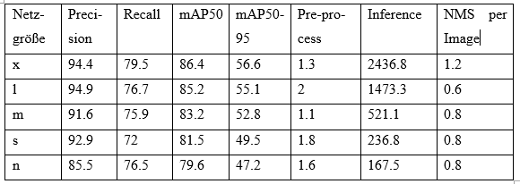

# Objekterkennung

## Beschreibung des Projektes

Bei dem UAVVaste-Projekt geht es darum, auf Drohnenbildern zu erkennen, ob Müll vorhanden ist oder nicht. Die GPS-Daten der Bilder, auf denen Müll erkannt wurde, können an einen Aufräumroboter geschickt werden, um gegen die Umweltverschmutzung vorzugehen. Dafür wurde das Netz YOLOv5 für die Objekterkennung trainiert und die Ergebnisse der verschiedenen Größen der Netze miteinander verglichen.

## Datensatz
Der verwendete Datensatz ist der UAVVaste-Datensatz, herunterladbar von Github: https://github.com/UAVVaste/UAVVaste. Dabei braucht man nur den annotations-Ordner, den man in einen config-Ordner legt. Dabei kümmert sich setup.py um das Herunterladen der Bilder und die Erstellung der Labels im für YOLOv5 benötigten Format. Das benötigte Format ist dabei in eine Text-Datei zu schreiben, in der die Klasse (hier immer 0, da nur eine Klasse) und die normalisierten x- und y-Koordinaten der Bounding Box sowie die normalisierte Breite und Höhe in dieser Rei-henfolge stehen. Dabei wird dies für jede Bounding Box des Bildes in einer neuen Zeile angegeben. Die entstehende Struktur der Ordner sieht folgendermaßen aus: -data --images ---test ---val ---train --labels ---test ---val ---train. 

## Beschreibung des Netzes YOLOv5

### Model Backbone
Der Backbone eines Modells ist ein vortrainiertes Netzwerk, dass für die Extrahierung der reichhaltigen Merkmale benutzt wird. Dies hilft, die räumliche Resolution des Bildes zu verringern und seine Merkmalsresolution, also die Resolution der Kanäle zu erhöhen. YOLOv5 benutzt CSP-Darknet53, wobei CSP für Cross Stage Partial steht, dessen Strategie auf das Darknet53 angewandt wurde. Das durch die Benutzung von Residual- und Dense-Blöcken, die das Problem der verschwindenden Gradienten beheben sollen, entstehende Problem der redundanten Gradienten wird durch die Abschneidung des Gradientenflusses behoben. Dabei wird die Merkmalskarte der Basisschicht in zwei Tei-le aufgeteilt und dann durch eine stufenübergreifende Hierarchie wieder zusammenge-führt. Vorteile davon sind, dass die Anzahl der Parameter und der Berechnungen ver-ringert werden, was sich positiv auf die Inferenzzeit auswirkt.

### Model Neck
Der Nacken des Modells wird benutzt, um Merkmalspyramiden zu extrahieren. Dies hilft dem Modell, Objekte auf verschiedenen Größen und Skalierungen gut zu generali-sieren. Als Nacken wird von YOLOv5 ein durch die Integration von BottleNeckCSP modifiziertes PANet benutzt. Dieses ist ein Merkmalspyramidennetzwerk, welches auch in YOLOv4 für die Verbesserung des Informationsflusses und der Lokalisierung zum Einsatz kam. Auch darauf wurde die Strategie von CSP angewandt. Außerdem kommt hier auch SPPF zum Einsatz. Ein SSP-Block führt eine Aggregation auf seiner Eingabe durch und gibt eine Ausgabe fester Größe zurück. Daher kann es das rezeptive Feld signifikant erhöhen und die relevantesten Kontextmerkmale segregieren, ohne die Ge-schwindigkeit des Netzwerks zu beeinträchtigen. Dies wurde schon in YOLOv3 und YOLOv4 verwendet, allerdings mit SPP anstatt SPPF-Block.

### Model Head
Der Kopf des Modells wird verwendet, um die finalen Operationen auszuführen. An-kerboxen werden auf die Merkmalskarten angewandt und als finale Ausgabe die Klas-sen, die Objektpunktzahlen und die Bounding Boxes berechnet. YOLOv5 benutzt den selben Kopf wie YOLOv3 und YOLOv4, welcher aus drei Convolutional-Schichten besteht, die den Ort der Bounding Boxes, die Objektpunktzahlen und –klassen vorher-sagen. Allerdings haben sich die Formeln für die Berechnung der Zielkoordinaten geän-dert.

### Versionen des Netzes
YOLOv5 gibt es in fünf Versionen, nämlich vom kleinsten bis größten n, s, m, l und x. Diese unterscheiden sich bezüglich der Schnelligkeit und Präzision, aber auch bezüglich der Komplexität.

## Ergebnisse
Ich habe alle Netzgrößen auf dieselben Daten für 300 Epochen trainiert. Dabei konnte man die Auswirkung der verschiedenen Größe der Netze auf das Trainingsergebnis gut betrachten. Folgender Tabelle ist das Ergebnis der Modelle der verschiedenen Netzgrö-ßen auf dem Validierungsdatensatz zu entnehmen. Evaluiert wurden immer die besten Gewichte. Die Angaben in der Tabelle sind in Prozent.

Folgende Tabelle enthält die Ergebnisse der verschiedenen Größen evaluiert auf dem Testdatensatz. Die Angaben für Precision, Recall und mAP sind in Prozent, die Anga-ben der Zeiten in Millisekunden und ohne Unterstützung der GPU.

Wie man sehen kann, liefert das größte Modell das beste und das kleinste Modell das schlechteste Ergebnis, so wie es in obigem Bild dargestellt wurde. Allerdings benötigt das größte Modell mit 10 Stunden und 33 Minuten am längsten für das Training, wäh-rend das kleinste mit 8 Stunden und 19 Minuten am wenigsten Zeit dafür benötigte. Die Zeiten der anderen liegen dazwischen, vom größten absteigend zum kleinsten. Das Trai-ning wurde dabei mit Unterstützung einer GPU durchgeführt. Auch benötigt das größte Modell für das Training natürlicherweise mehr GPU-Speicher, nämlich 7.56 Gigabyte, während das kleinste nur 1.79 braucht. Auch dabei, wie schnell das Modell vorhersagen trifft, ist wie zu erwarten das größte Modell am langsamsten und das kleinste am schnellsten. Allgemein muss man also entweder bei der Genauigkeit Abstriche machen oder bei der Schnelligkeit. Dies ist für jedes Problem individuell zu wählen. Für die Müllerkennung kann man das von der Drohne aufgenommene Video speichern und auf den Computer herunterladen und so das größte Modell mit der größten Genauigkeit und der langsamsten Vorhersagedauer nehmen. Beispielsweise können so Videos am einem Tag aufgenommen und analysiert werden, sodass der Aufräumroboter dann in der Nacht seine Arbeit erledigen kann. 
